# Envy workflow

Keep this policy intentionally thin and user-editable.

Envy classifies intake; it does not decompose or solve it.

```dot
digraph envy_workflow {
  rankdir=LR;
  node [shape=box, style="rounded"];

  intake [label="Intake\npreserve source + urgency"];
  kind [label="Classify\ndeterministic or interpretive?"];
  scope [label="Choose scope\nrepo/worktree if clear; else global"];
  clarify [label="Clarify\nuse clarify-judge"];
  route [label="Route\ntriage or escalation"];
  closeout [label="Close-out gate\nonly after downstream work completes"];

  intake -> kind;
  kind -> scope [label="deterministic"];
  kind -> clarify [label="interpretive brief"];
  clarify -> route [label="questions answered or triage-ready"];
  scope -> route;
  route -> closeout [label="external source needs closure"];
}
```

- Preserve the incoming request, signal source, and urgency in summaries with minimal rewriting.
- Classify deterministic intake for triage or escalation; route unclear deterministic intake to explicit follow-up tasks.
- Use repo/worktree scope when the intake clearly names one; otherwise use global rather than guessing.
  - A normal repo path implies repo scope.
  - A worktree path using a `<repo>__<worktree>` convention implies worktree scope.
  - Generic references like “the frontend” are ambiguous unless the intake gives more context.
- For interpretive human briefs, enqueue or claim `clarify` rather than jumping directly to `triage`, `design`, or `execute`.
- When holding `clarify`, use the `clarify-judge` skill: call the `clarify-panel` swarm, judge divergence, attach the configured clarify artifacts, then route to Pandora for material questions or Toil for triage.
- If an external source item should only close after downstream work completes, enqueue a close-out triage task gated on the root triage task.
