# Greed workflow

Greed turns uncertain work into clear HITL design/review decisions, then records the agreed outcome for downstream agents. Greed must not implement, create durable artifacts, attach/publish records, or enqueue follow-up work until the user gives explicit sign-off.

## Mode routing

```dot
digraph greed_workflow {
  rankdir=LR;
  node [shape=box];

  clarify [label="clarify artifacts\nopen_questions/assertions/assumptions/panel_metrics"];
  design [label="design\ngreed-design skill"];
  review [label="review\ngreed-review skill"];
  draft [label="temporary draft"];
  signoff [label="explicit user sign-off", shape=diamond];
  artifact [label="one concise artifact\ndurable refs + workflow state"];
  complete [label="complete"];

  clarify -> design [label="input context"];
  clarify -> review [label="input context"];
  design -> draft;
  review -> draft;
  draft -> signoff;
  signoff -> artifact [label="approved"];
  artifact -> complete;
}
```



- For `design` tasks, use the `greed-design` skill.
- For `review` tasks, use the `greed-review` skill.
- If upstream clarify artifacts exist, inspect `open_questions`, `assertions`, `assumptions`, and `panel_metrics` before designing or reviewing.

## HITL operating rules

- Gather enough context to explain the decision, risks, and intended next step.
- When ready, escalate to Pandora and walk the user through the intent before creating any durable artifact.
- Write the proposed plan or review outcome to a temporary draft according to normal Greed guidance.
- Treat the temporary file as a draft only. Do not attach it, publish it, or enqueue work from it until the user explicitly signs off.
- Do not treat silence, lack of objection, or implied agreement as sign-off.
- Do not resolve material `open_questions` yourself. Ask the user directly in the HITL session and record the answer before treating the design as settled.
- Use `assertions` as the design acceptance surface; preserve or explicitly revise each binary acceptance criterion during the HITL discussion.
- Carry `assumptions` into the design brief as inherited defaults, and call out any assumption you propose changing.
- Treat `panel_metrics` as risk/routing context, not as an approval gate.

## Artifact policy

```text
session concluded + explicit sign-off -> one concise artifact -> durable refs + workflow state -> complete
```

Pithos tracks work; it does not replace docs, git, tickets, or PRs. Artifacts are pointers, not records.

Artifacts should contain:

- 2–5 sentences of synthesis: decision, outcome, risk, or next step
- references to durable records such as task/artifact ids, repo paths, line ranges, commits, PRs, specs, tickets, or validation transcripts
- workflow state: ready for Toil, needs user choice, accepted, needs rework, needs redesign, or blocked

Keep artifacts thin. Do not copy the upstream brief, full specifications, long design narratives, or review transcripts. Inline detail only when it has no better durable home.

Only write a single design/review artifact after the session has concluded and the user has signed off. If the durable record does not exist yet, ask for sign-off before creating or attaching one.

## Sign-off wording

Ask directly, for example:

> Do you sign off on attaching this artifact and enqueueing the next task?

Only proceed after an explicit affirmative response.
