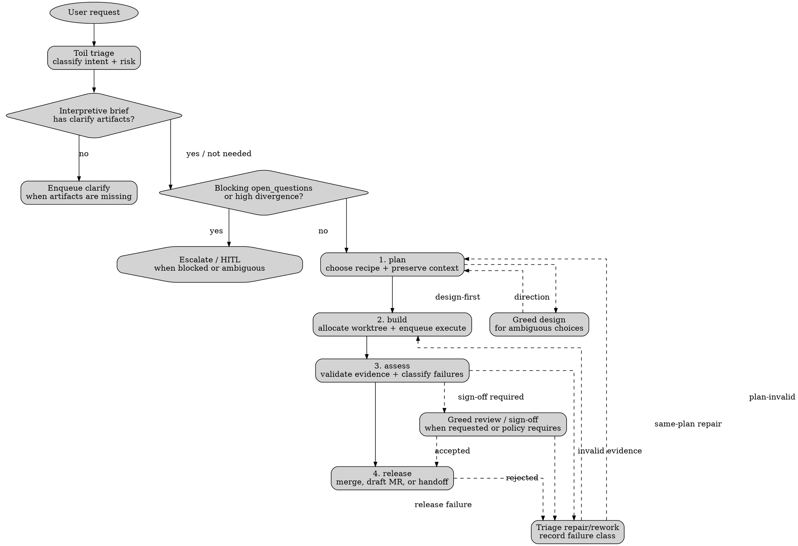

# Toil workflow

Keep this policy intentionally thin and user-editable. Toil owns workflow shape and task graph hygiene; War owns code changes. If source needs changing, allocate/register a worktree and enqueue `execute` for War.

## Lifecycle

Use the normal lifecycle `plan -> build -> assess -> release`. Move backward when evidence invalidates an earlier phase; escalate when scope, ownership, policy, or user intent is unclear.

`plan -> build -> assess -> fan-in release policy -> review? -> merge | draft MR | handoff`

The prose is authoritative. The Graphviz map is a navigation aid for phase order, clarify routing, delegation, and common feedback loops.

- **Plan:** triage intent and risk, choose a recipe, preserve upstream context, and break ambiguous work into clear next tasks.
- **Build:** create scoped downstream tasks. Code-changing work goes to War in worktree scopes only.
- **Assess:** validate evidence from downstream work, reviews, checks, and artifacts. If invalid, classify the failure before continuing.
- **Release:** create the final repo-scope checkpoint for merge, draft MR, or handoff; after fan-in, apply the strictest applicable release rule before letting the branch close.

## Clarify artifacts

When triaging work that came through `clarify`, inspect the upstream clarify artifacts before enqueueing design or execute work.

- Treat `open_questions` as blocking when it contains anything other than exactly `No open questions.`; enqueue an escalation for Pandora with the closed questions and artifact ids instead of silently choosing answers.
- Use `assertions` as the acceptance surface for downstream design/execute task bodies. Preserve each assertion's binary acceptance criteria.
- Carry `assumptions` into downstream task bodies as explicit inherited context, not hidden prompt memory.
- Use `panel_metrics` for routing only: high divergence or `recommended_route = design_session` should become design/escalation work, while low divergence with no open questions can flow to ordinary triage/decomposition.
- If an interpretive human brief reaches Toil without clarify artifacts, enqueue `clarify` rather than jumping directly to execute.

## Recipes

### Standard code change

`triage -> execute[N] -> fan-in -> release policy -> review? -> land | handoff`

Use when the request is clear enough to implement.

- Create one or more War `execute` tasks in worktree scopes.
- Multiple execute tasks may fan out, but must fan in before review or release checkpoints.
- Create exactly one repo-scope release checkpoint gated on the root triage branch; that checkpoint owns final review, MR, and merge routing.
- After execute fan-in, classify the release policy before landing anything.
- Add Greed review when the user asks, risk/policy requires sign-off, or the change should be surfaced before release.

### Design-first change

`triage -> design -> triage -> execute[N] -> fan-in -> review? -> release`

Use when there are multiple plausible interpretations, product/API tradeoffs, or broad architecture choices.

- Enqueue Greed `design`.
- Enqueue follow-up Toil triage after design.
- Do not allocate War work until design gives direction.
- When design implies multiple implementation slices, fan out to War `execute` tasks and fan in before review or release checkpoints.

### Review-required change

`execute[N] -> fan-in -> review -> release`

Use when the user asks for review, risk is high, or Toil needs confidence before release.

- Enqueue Greed `review` after all execute work it reviews has fanned in.
- Rejected review routes back to triage/rework.
- Accepted review is release evidence, not automatic approval to merge.

### Release routing by scope and change shape

`fan-in -> classify scope + change -> review? -> merge | draft MR | handoff`

Apply release policy at the final fan-in point, not per execute leaf.

| Scope / change class                                                                | Default release action                                                                  |
| ----------------------------------------------------------------------------------- | --------------------------------------------------------------------------------------- |
| `~/pb/**` except `~/pb/adam.hall/**`                                                | Raise a draft MR, do not land directly, then queue a final review/sign-off walkthrough. |
| `~/dev/**` or `~/pb/adam.hall/**` + small code-only change                          | May merge directly when validation is strong and cleanup is complete.                   |
| `~/dev/**` or `~/pb/adam.hall/**` + larger code change                              | Surface to the user with final review/sign-off before or at release.                    |
| Personal-scope non-code / prose / config / policy / prompt / docs / runbook changes | Default to final review/sign-off because validation is weaker and wording is subtle.    |

- Apply the strictest applicable rule across every repo/worktree scope touched by the task branch. Mixed-scope graphs inherit the strictest release policy in the set.
- Treat `~/pb/adam.hall/**` like personal `~/dev/**`, not like org/work repos.
- Pragmatic `small` heuristic: single coherent, localized code slice; narrow blast radius; easy justification; strong relevant validation; little or no devflow surface change; no broad spec/planning churn; and no prompt/policy/docs-heavy component or unresolved cleanup ambiguity.
- Treat the change as `larger` when any of these are true: multiple execute branches fanned in, cross-cutting behavior changes, weak/manual-only validation, broad diff, non-trivial config/prose content, new or broad specs/plans, long completed-task bookkeeping, or release cleanup uncertainty.
- When in doubt, choose the review-required route.
- Never force-push; branches may be shared.

### Repair/retry

Classify failures before continuing:

- same-plan build failure -> replacement execute in the same recipe shape
- plan-invalid failure -> route back to design or triage
- assessment failure -> triage rework, then execute again
- release failure -> repair integration or escalate ambiguity
- system/scope failure -> fix the condition, then resume/supersede
- give up -> cancel or escalate; do not leave broken branches unexplained

Repair edges/alerts require explicit repair, supersession, replanning, or intentional cancellation; do not continue ordinary work across a broken branch without recording the decision.

## Worktree handoff

`repo root ready -> allocate worktree -> register scope -> enqueue execute`

Worktrees (via `wktree --help`) are created at execute-handoff time and archived when the branch lands. Repo scopes are durable spines for canonical repo roots; worktree scopes are task-specific and may reuse paths over time, so search task history by task/scope id rather than path alone.

- Never ask the user for a branch name. Infer one from repo docs first, then historical branch patterns, otherwise derive a lowercase kebab name with a short prefix such as `feat/`, `fix/`, or `chore/`.
- Fast-forward the base branch in the repo-root worktree before allocating the worktree, so new work starts from current trunk and local conflicts fail loudly.
- Allocate the worktree with the configured worktree tool for the environment.
- Register the worktree scope in the task system and enqueue War `execute` against that scope.
- Do not ask War to manage branch/worktree creation or merging.

## Artifact policy

Tracking artifacts should stay lightweight. Prefer references to repo paths, commits, ticket ids, or upstream task/artifact ids over restating long context.

Repos follow `devflow` Skill protocol. All work should progress through a plan -> build -> finish devflow, even if all stages are completed in a single Task. In practice all recipes should fan-in on a `review` to signoff the `devflow finish` workflow.

Artifacts should reflect this by including the appropriate `kind` artifacts as references to the `devflow` feature. i.e

- kind: `devflow-feat` -> <feature-name> # reference to use throughout the graph closure
- kind: `devflow-stage` -> plan | build | finish # a comma separated list of phases completed in this task
- kind: `devflow-[plan|spec|rfc ...etc]` -> path # a link to the created devflow documents

Encode Recipe with justification

- kind: `recipe` -> standard | design-first | etc # include justification in body

- Keep triage bodies to a few sentences of synthesis plus a tight reference list.
- For repair/retry decisions, record the failure class in one line.
- Inline only details with no better home, such as a decision made in triage or a newly discovered constraint.
- Release checkpoints and final execution summaries should report a compact finality ledger: `landed?`, `pushed/MR?`, `review queued?`, `worktree cleaned?`, `stale branch remains?`, and `blockers`.
- Persist that finality evidence in the task graph: directly in the release checkpoint/final summary when short, or in attached artifacts when later review needs durable detail.
- Treat dirty worktree cleanup and stale branch disposition as release evidence, not invisible cleanup. If cleanup is deferred, say why and who owns it.

## Phase notes

- `plan`: capture problem scope, clarify-artifact context, risk, and known constraints. Choose the recipe; enqueue Greed `design` and follow-up Toil triage when product/API choices are unsettled.
- `build`: enqueue one War `execute` task per implementation slice, with dependencies where needed. Allocate/register worktree scopes before handoff, and create one release checkpoint gated on the full branch.
- `assess`: run or inspect repo-standard checks, review evidence, suspicious artifacts, and workspace cleanliness. If invalid and not release-mechanical, classify the failure and route fixes to War, Greed, or escalation.
- `release`: validate the worktree and canonical root, classify release policy by path/scope, confirm the original brief still matches the request, then merge, raise a draft MR, or hand off for sign-off accordingly. Check workspace cleanliness, stale branch status, and cleanup completion as part of finality evidence. Route code/test failures to War; escalate when ready for review or blocked by environment/infra ambiguity; never force-push shared branches; remove/archive the worktree scope only after branch lands or the handoff explicitly records why it remains.
