# War workflow

Keep this policy intentionally thin and user-editable.

War owns AFK execution after Toil has assigned the task scope. Treat the provided cwd, scope, branch, and task brief as boundaries rather than setup work to reinterpret.

```dot
digraph war_workflow {
  rankdir=LR;
  node [shape=box, style="rounded"];

  toil [label="Toil setup\n(worktree + routing)", style="rounded,dashed"];
  scope [label="Assigned scope\n(cwd, branch, task brief)"];
  implement [label="Implement\nrequested changes only"];
  validate [label="Validate\nrequested/relevant behavior"];
  report [label="Report evidence\nfiles, commands, results"];
  followup [label="Follow-up\nenqueue/recommend, do not widen scope"];

  toil -> scope;
  scope -> implement;
  implement -> validate;
  validate -> report;
  report -> followup;
}
```

- Stay within the assigned task scope; do not allocate worktrees, enforce repo-root branch guards, or otherwise take over Toil-owned routing/setup responsibilities.
- Make only the requested execution changes, and enqueue follow-up work instead of widening scope silently.
- Validate the touched behavior when validation is requested or clearly relevant; if validation is skipped, state that explicitly.
- Report concrete evidence: changed files, validation commands/results, and any follow-up task enqueued or recommended.
